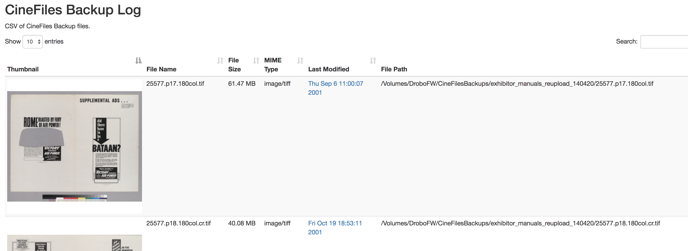

# CineFiles Backup Log Maker

This is a set of scripts that produce a CSV log of redundant backups of images for [CineFiles](bampfa.org/cinefiles) and generates an HTML table view of that CSV. The CSV generator uses imagemagick `mogrify` to produce a ~~base64 encoded~~ `.png` version of each image for reference. 

## Usage

Run `python log.py` to create the backup CSV, which is saved in the `data/` folder. Thumbnails are saved to `images/thumbs/`.

To test it locally run `python2.7 -m SimpleHTTPServer` and go to [http://localhost:8000](http://localhost:8000)

## Ideas taken from:

The HTML portion came from Derek Eder's [csv-to-html project](https://github.com/derekeder/csv-to-html-table) (Copyright (c) 2015 Derek Eder.)

The filesize calculation came from [this stack overflow thread](http://stackoverflow.com/questions/14996453/python-libraries-to-calculate-human-readable-filesize-from-bytes).

## Dependencies

**csv-to-html** has its own dependencies (bootstrap, jquery, jquery csv, DataTables). 

The python portion requires [imagemagick](https://www.imagemagick.org/script/index.php) be installed, but uses the standard python library. Tested with python 3.5.

## Update 6/26/2017

OK, so the base64 idea worked fine with a small test batch, but running against the entire backup directory generated a CSV that was over 1GB and the **-to-html** part tried to render the whole thing at once. Oops. 

Now the `mogrify` command outputs thumbnail .png files all set to the same aspect ratio into `images/thumbs/`. It still has to load everything at once but (at least locally) it loads fine for now. I also have the files renamed as a hash of the original filepath (to account for possible accidental duplicates? i.e.:  `140225Maya/12345.p1.300gray.tif` vs `161120Cassie/12345.p1.300gray.tif` ). In the next iteration I gotta add the hash to the CSV though so that there is a link between the filename and the thumbnail. Or just skip the hash part since it's probably not necessary.

## Update 7/5/2017

I added a couple of handy steps: `index.html` is updated with the most current csv as `log.py` runs. There is a text file that notes the date of the last log process that helps with this. Also, the logger checks a running list of filepath hashes to see whether or not to log a given file. This might be better accomplished by moving logged files to a different path on the DROBO rather than having to check the huge text file for each step. 

This took something like 4 hours to run against the whole set of 29,000 backup images we have locally (2008-present?). The HTML kills Chrome, but works locally in Firefox. I should probably start looking for a different solution (that will also hpoefully be more stable long-term).

## TO DO

This is in progress!

~~The python script was originally fed into a Mac automator applet, so there's a request for the filepath to be logged.~~ I need to make it run using crontab and the resulting html should be pushed to a static (password-protected) site. Need to figure out where to host that will be secure.

Er, find a different way entirely to do this.

~~Change the html in `index.html` to look for today's date in the csv filepath to match the latest CSV.~~ Done 6/30

~~Add function to check for a folder (or file?) already in the log. Maybe referencing the handy hash that's available?~~ Done 6/30

## Sample Screenshot

